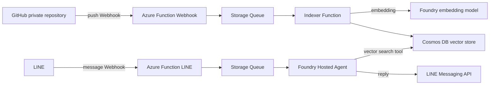

# 技術ブログ検索エージェント 初期構想

作成日: 2026-08-10  
目的: Azure AI関連スタックを学習しながら、GitHubで管理している自分の技術ブログをLINEから検索・質問できるようにする。

## 1. 概要

技術ブログをベクトル検索可能なナレッジベースにし、Azure AI FoundryのHosted Agentから検索ツールとして利用する。ユーザーインターフェースはLINEとする。

学習目的のため実用性よりも、次の技術を一通り触れることを重視する。

- GitHub Webhook
- Azure Functions
- Azure Storage Queue
- Azure AI Foundryの埋め込みモデルおよびHosted Agent
- Azure Cosmos DBのベクトル検索
- LINE Messaging API
- Managed Identity / Entra ID / GitHub認証

## 2. 想定アーキテクチャ



## 3. GitHub Webhookの位置づけ

GitHub Webhookは記事本文を送信する仕組みではなく、更新を通知する仕組みである。`push` payloadには、ブランチ名、`before` / `after` のコミットSHA、コミット情報、変更ファイルのパス、比較URLなどが含まれる。一方、Markdown本文やリポジトリ全体は含まれない。

そのため、Webhook受信後にGitHub APIを呼び出して、`after` SHA時点のファイルを取得する。

```json
{
  "ref": "refs/heads/main",
  "before": "abc123...",
  "after": "def456...",
  "forced": false,
  "commits": [
    {
      "id": "def456...",
      "added": ["articles/new.md"],
      "modified": ["articles/azure.md"],
      "removed": ["articles/old.md"]
    }
  ]
}
```

### Webhook受信Functionの責務

1. `X-Hub-Signature-256` を検証する
2. `X-GitHub-Event` が `push` か確認する
3. 対象ブランチ以外、タグ操作、削除イベントなどを除外する
4. `X-GitHub-Delivery` を使って重複配信を検知する
5. `repo`, `ref`, `before`, `after`, `deliveryId` だけをQueueへ投入する
6. 速やかにHTTP 2xxを返す

本文取得やベクトル化はWebhook Function内で行わず、Queueワーカーへ分離する。

## 4. インデックス作成フロー

### 初期同期

初回はリポジトリの対象ディレクトリを全件取得し、記事ごとに次の処理を行う。

1. Markdownのfront matter、本文、見出しを解析
2. ある程度意味のまとまった単位にチャンク分割
3. Foundryのembeddingモデルでベクトル化
4. Cosmos DBへチャンク単位でupsert

### 更新同期

まずは実装を単純にするため、`after` SHA時点の対象記事を取得し、`contentHash` を比較して変更された記事だけを再ベクトル化する方式を採用候補とする。

将来的には、`before` / `after` を使ってCompare APIで変更パスを取得し、追加・変更ファイルだけを処理する差分同期へ最適化できる。

### 冪等性・削除対応

Cosmos DBには少なくとも次の情報を持たせる。

- `articleId`
- `path`
- `sourceUrl`
- `commitSha`
- `contentHash`
- `chunkIndex`
- `heading`
- `text`
- `embedding`

記事更新時は、既存チャンクを削除してから新しいチャンクをupsertする。記事削除時は、該当パスのチャンクを削除する。Webhookの再送やQueueの再実行があっても同じ結果になるようにする。

## 5. プライベートリポジトリの認証

GitHubからAzure FunctionへWebhookを送ること自体は、リポジトリがプライベートでも問題ない。必要なのは、Azure FunctionからGitHub APIで記事本文を読むための認証である。

候補は次のとおり。

- 学習用の最短構成: fine-grained PAT、対象リポジトリ限定、`Contents: read`
- より適切な構成: GitHub Appを対象リポジトリだけにインストールし、読み取り専用のInstallation Tokenを取得

トークンはWebhookのURLやpayloadには含めず、AzureのKey VaultまたはFunctionの安全な設定領域で管理する。

## 6. LINEからHosted Agentを呼ぶフロー

LINE Webhook Functionでは署名検証と最低限の入力整形だけを行う。Hosted Agentの実行はStorage Queueのワーカーに任せ、LINE Webhookのタイムアウトを避ける。

1. LINE Webhookを受信
2. LINE署名を検証
3. `replyToken`, `userId`, `messageText`, `timestamp` をQueueへ投入
4. HTTP 2xxを返す
5. QueueワーカーがHosted Agentを呼び出す
6. Hosted AgentがCosmos DBのベクトル検索ツールを呼ぶ
7. 回答をLINE Messaging APIで返信する

## 7. Hosted Agentと検索ツール

Hosted Agentは今回の学習の中心要素として必ず利用する。Cosmos DB検索をエージェントのツールとして公開し、質問に関連する記事チャンクを取得させる。

検索結果には、本文だけでなく記事タイトル、URL、見出し、チャンク番号を含める。エージェントの回答には参照元記事のリンクを付ける。

## 8. 費用・サービス選定方針

- Hosted Agentおよびモデル利用料は、学習目的として少額の課金を許容する
- Functions、Storage Queue、Cosmos DBは無料枠または最小構成を優先する
- コンテナ化を必須にせず、Functionsはソースコード/ZIPデプロイを基本とする
- ACRを常時利用する構成は避ける
- 予算アラートを設定し、Foundryモデル・Hosted Agentの呼び出し回数をログで把握する

無料枠や単価は変更されるため、実装時に対象リージョンとプランの料金を確認する。

## 9. MVPの範囲

最初から全機能を作り込まず、次の順番で進める。

1. ローカルスクリプトで記事をCosmos DBへ初期登録
2. Cosmos DBのベクトル検索ツールをHosted Agentから呼ぶ
3. LINEから固定質問を送り、Hosted Agentの回答を返す
4. GitHub Webhookで更新通知を受けてQueueへ積む
5. Queueワーカーで記事を再インデックスする
6. 削除・rename・force push・重複配信を処理する

## 10. 主なリスクと対策

| リスク | 対策 |
|---|---|
| Webhookの再送・重複 | `X-GitHub-Delivery` と冪等なupsert |
| Webhookの取りこぼし | 定期的な全件 reconcile または手動同期コマンド |
| 複数pushの順序逆転 | Queueメッセージの `after` SHAを基準に取得し、contentHashで最終状態を確認 |
| force push | 全件同期へフォールバック |
| GitHub API認証漏えい | GitHub Appまたはfine-grained PAT、Key Vault、最小権限 |
| LINE/Agentのタイムアウト | Webhookと処理をQueueで分離 |
| 予想外の課金 | 予算アラート、呼び出し数制限、ログ監視 |

## 11. 参照

- [GitHub Webhook events and payloads](https://docs.github.com/en/webhooks/webhook-events-and-payloads)
- [Best practices for using webhooks](https://docs.github.com/en/webhooks/using-webhooks/best-practices-for-using-webhooks)
- [Validating webhook deliveries](https://docs.github.com/en/webhooks/using-webhooks/validating-webhook-deliveries)
- [GitHub Contents API](https://docs.github.com/en/rest/repos/contents)
- [GitHub Commits API](https://docs.github.com/en/rest/commits/commits)

## 12. 未確定事項

- ブログ記事の実際のパス・形式・front matter
- GitHubの対象ブランチ
- GitHub Appとfine-grained PATのどちらを採用するか
- Cosmos DBのAPI、パーティションキー、ベクトルインデックス設定
- embeddingモデルとチャンクサイズ
- Hosted AgentからCosmos DB検索を呼ぶ具体的なツール公開方法
- LINE返信の非同期UX（処理中メッセージ、Push Message、再試行）
- Azure各サービスのリージョン、プラン、無料枠適用可否
