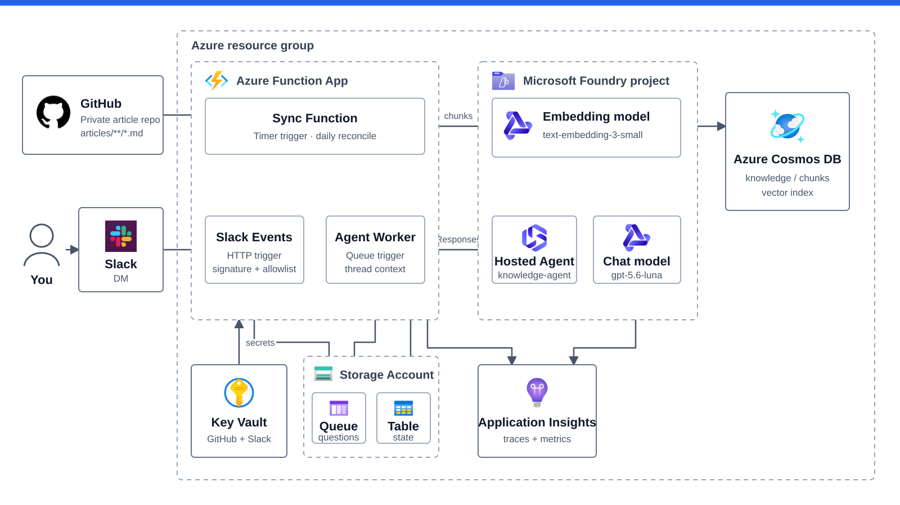

# 技術ナレッジ検索エージェント

Azure AI関連スタックを学びながら、自分の技術ブログをSlackから検索・質問できる個人用エージェントを作る。MVPはGitHubで管理するZenn記事を検索対象にし、Azure AI Foundry Hosted Agentで回答する。

## MVPで提供すること

- 非公開GitHub repositoryのdefault branchにある`articles/**/*.md`を同期し、ベクトル検索できるようにする
- Timer Functionが日次でcommit SHAとblob SHAを確認し、変更のあった記事だけを再indexする
- Slack AppとのDMで質問を受け、検索根拠へのリンク付きでスレッド返信する。同じスレッドの直前の会話を踏まえた追い質問に答えられる
- 処理状況と失敗を追跡できる最低限のトレースと約10件のsmoke evaluationを持つ

画像OCR、複数利用者・高可用性、Block Kit、streaming、rollback機構、continuous evaluationはMVPの対象外とする。Slack Agent機能は有料planを必要とするため見送り、回答待ちは`eyes` reactionで示す。判断の詳細は[Slack Agent機能を採用しない理由](docs/platform-and-operations.md#slack-agent機能を採用しない理由)を参照する。

## 実装状況

実装計画Step 0〜7のcode-sideは完了した。日次Timerによる認証付きGitHub取得、chunk / embedding、Cosmos記事置換、Table同期状態、Slack受信からAgent応答までの結線、telemetryとsmoke evaluationまでをunit / mock integration testで確認済みである。残るのは実resource作成の許可、`azd provision` / `azd deploy`、Slack AppとKey Vaultのbootstrap、実環境での疎通・trace・smoke確認である。Azure resourceはまだ作成していない。

## 最小構成

矢印は主要な依存関係とデータアクセスを示し、request / responseの完全な時系列は表さない。図はBicepと実装に基づく予定構成であり、Azure resourceはまだ作成していない。

## 採用と重要な決定

- AzureはJapan Eastを第一候補にし、FoundryはLuna、埋め込みは`text-embedding-3-small`を使う。
- 検索対象は`articles/**/*.md`の全記事。`published`の値では除外しない。
- 差分判定はGit Trees APIのblob SHAで行い、content hashを自前で計算しない。
- 会話履歴はHosted AgentのResponses protocolが管理し、Workerは`previous_response_id`で会話をつなぐ。Agent内部のmodel callは`store: false`とする。
- Slackは単一workspace・単一利用者・DMだけを対象とし、トップレベルメッセージを会話の起点、スレッド内メッセージを追い質問として扱う。
- 記事repositoryはKey Vault由来のGitHub tokenで認証したGitHub APIで読み、Azure内の接続はManaged Identityを使う。
- 個人MVPなので、deployはローカルの`azd`から行い、deploy後の確認は一度の疎通確認に限定する。
- コスト方針は[プラットフォームと運用](docs/platform-and-operations.md#コストと日常運用)を正とする。予算アラートはproject単位ではなくAzureテナント全体で一括設定する。

詳細な設計値と運用手順は、READMEへ重複させず下記を正とする。

## 文書マップ

| 文書 | 役割 |
|---|---|
| [architecture.md](docs/architecture.md) | データ同期・質問応答・データ契約・identity/RBACの設計上の正本 |
| [platform-and-operations.md](docs/platform-and-operations.md) | Azure採用設定、IaC、bootstrap、deploy・運用の正本 |
| [telemetry.md](docs/telemetry.md) | 観測で答える問い、signalの役割分担、span / logの設計と量の制御の正本 |
| [quality.md](docs/quality.md) | content記録、Hosted Agentの評価設計、運用指標とMVP後の品質施策の正本 |
| [implementation-plan.md](docs/implementation-plan.md) | 着手条件、実装順、vertical slice、完了条件の正本 |
| [repository-policy.md](docs/repository-policy.md) | 個人開発に見合う設計範囲、公開repository、IaC、供給網に関する恒久ポリシー |
| [research/implementation-readiness-2026-08-11.md](docs/research/implementation-readiness-2026-08-11.md) | 調査時点の根拠・capacity snapshot・統合判断の記録。現行設計の正本ではない |
| [research/implementation-current-spec-2026-08-11.md](docs/research/implementation-current-spec-2026-08-11.md) | 実装計画Step 0で確認したtooling、scaffold、RBAC、AVM versionの記録 |

## 現在地

初期構想と実装方針は確定済みで、[実装計画](docs/implementation-plan.md)Step 0からStep 2のcoreと、Step 3のIaC / deploy wiringの静的実装まで進んだ。Azure resourceと外部サービス設定はまだ作成していない。既存Azure CLI内蔵Bicepは確認済みだが、固定AVMのrestoreはSocket Firewall非対応の依存取得になるためBicep buildを保留している。次は安全なrestore経路を確定してStep 3 gateを閉じる。
