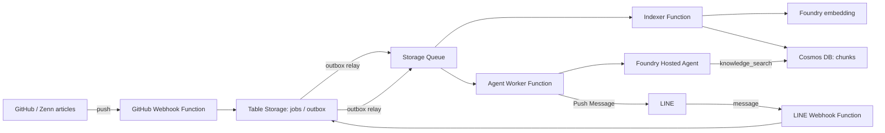

# 技術ナレッジ検索エージェント

Azure AI関連スタックを学びながら、自分の技術ブログをLINEから検索・質問できる個人用エージェントを作る。MVPはGitHubで管理するZenn記事を検索対象にし、Azure AI Foundry Hosted Agentで回答する。

## MVPで提供すること

- GitHubのdefault branchにある`articles/**/*.md`を同期し、ベクトル検索できるようにする
- GitHub Appで記事を読み、push Webhookで更新を非同期同期する
- LINEの1:1チャットで質問を受け、検索根拠へのリンク付きでPush Messageを返す
- 処理状況と失敗を追跡できる最低限のトレースと約10件のsmoke evaluationを持つ

画像OCR、複数利用者・高可用性、自動rollback、continuous evaluationはMVPの対象外とする。

## 最小構成

## 採用と重要な決定

- AzureはJapan Eastを第一候補にし、FoundryはLuna Max、埋め込みはlargeを使う。
- 検索対象は`articles/**/*.md`の全記事。`published`の値では除外しない。
- GitHubの読取りは対象repository限定のGitHub App、Azure内の接続はManaged Identityを使う。
- 個人MVPなので、deploy後の確認は一度の疎通確認、失敗時の復旧は手動rollbackとする。
- コスト方針とAzure Budgetは[プラットフォームと運用](docs/platform-and-operations.md#コストと日常運用)を正とする。

詳細な設計値と運用手順は、READMEへ重複させず下記を正とする。

## 文書マップ

| 文書 | 役割 |
|---|---|
| [architecture.md](docs/architecture.md) | データ同期・質問応答・データ契約・identity/RBACの設計上の正本 |
| [platform-and-operations.md](docs/platform-and-operations.md) | Azure採用設定、IaC、bootstrap、deploy・運用の正本 |
| [quality.md](docs/quality.md) | telemetry、content記録、MVP評価とMVP後の品質施策の正本 |
| [implementation-plan.md](docs/implementation-plan.md) | 着手条件、実装順、vertical slice、完了条件の正本 |
| [repository-policy.md](docs/repository-policy.md) | 公開repository、IaC、供給網に関する恒久ポリシー |
| [research/implementation-readiness-2026-08-11.md](docs/research/implementation-readiness-2026-08-11.md) | 調査時点の根拠・capacity snapshot・統合判断の記録。現行設計の正本ではない |

## 現在地

初期構想と実装方針は確定済みで、Azure resource、実装コード、外部サービス設定はまだ作成していない。実装は[実装計画](docs/implementation-plan.md)の開始条件を満たしてから行う。
