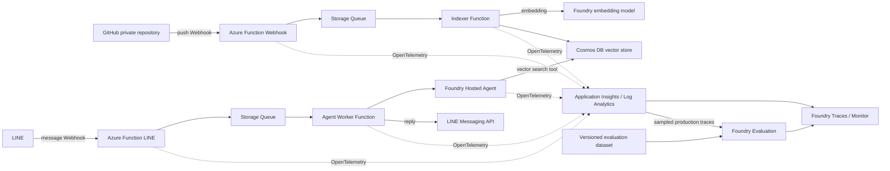

# 技術ナレッジ検索エージェント 初期構想

作成日: 2026-08-10  
目的: Azure AI関連スタックを学習しながら、自分の技術ナレッジをLINEから検索・質問できるようにする。MVPではGitHubで管理している技術ブログを最初のデータソースとする。

## 1. 概要

技術ブログを起点に、技術メモや設計資料などへ拡張可能なベクトル検索ナレッジベースを作る。Azure AI FoundryのHosted Agentから検索ツールとして利用し、ユーザーインターフェースはLINEとする。

学習目的のため実用性よりも、次の技術を一通り触れることを重視する。

- GitHub Webhook
- Azure Functions
- Azure Storage Queue
- Azure AI Foundryの埋め込みモデルおよびHosted Agent
- Azure Cosmos DBのベクトル検索
- LINE Messaging API
- Managed Identity / Entra ID / GitHub認証

## 2. 想定アーキテクチャ



## 3. GitHub Webhookの位置づけ

GitHub Webhookは記事本文を送信する仕組みではなく、更新を通知する仕組みである。`push` payloadには、ブランチ名、`before` / `after` のコミットSHA、コミット情報、変更ファイルのパス、比較URLなどが含まれる。一方、Markdown本文やリポジトリ全体は含まれない。

そのため、Webhook受信後にGitHub APIを呼び出して、`after` SHA時点のファイルを取得する。

```json
{
  "ref": "refs/heads/main",
  "before": "abc123...",
  "after": "def456...",
  "forced": false,
  "commits": [
    {
      "id": "def456...",
      "added": ["articles/new.md"],
      "modified": ["articles/azure.md"],
      "removed": ["articles/old.md"]
    }
  ]
}
```

### Webhook受信Functionの責務

1. `X-Hub-Signature-256` を検証する
2. `X-GitHub-Event` が `push` か確認する
3. 対象ブランチ以外、タグ操作、削除イベントなどを除外する
4. `X-GitHub-Delivery` を使って重複配信を検知する
5. `repo`, `ref`, `before`, `after`, `deliveryId` だけをQueueへ投入する
6. 速やかにHTTP 2xxを返す

本文取得やベクトル化はWebhook Function内で行わず、Queueワーカーへ分離する。

## 4. インデックス作成フロー

### 初期同期

初回はリポジトリの対象ディレクトリを全件取得し、記事ごとに次の処理を行う。

1. Markdownのfront matter、本文、見出しを解析
2. ある程度意味のまとまった単位にチャンク分割
3. Foundryのembeddingモデルでベクトル化
4. Cosmos DBへチャンク単位でupsert

### 更新同期

まずは実装を単純にするため、`after` SHA時点の対象記事を取得し、`contentHash` を比較して変更された記事だけを再ベクトル化する方式を採用候補とする。

将来的には、`before` / `after` を使ってCompare APIで変更パスを取得し、追加・変更ファイルだけを処理する差分同期へ最適化できる。

### 冪等性・削除対応

Cosmos DBには少なくとも次の情報を持たせる。

- `articleId`
- `path`
- `sourceUrl`
- `commitSha`
- `contentHash`
- `chunkIndex`
- `heading`
- `text`
- `embedding`

記事更新時は、既存チャンクを削除してから新しいチャンクをupsertする。記事削除時は、該当パスのチャンクを削除する。Webhookの再送やQueueの再実行があっても同じ結果になるようにする。

## 5. プライベートリポジトリの認証

GitHubからAzure FunctionへWebhookを送ること自体は、リポジトリがプライベートでも問題ない。必要なのは、Azure FunctionからGitHub APIで記事本文を読むための認証である。

候補は次のとおり。

- 学習用の最短構成: fine-grained PAT、対象リポジトリ限定、`Contents: read`
- より適切な構成: GitHub Appを対象リポジトリだけにインストールし、読み取り専用のInstallation Tokenを取得

トークンはWebhookのURLやpayloadには含めず、AzureのKey VaultまたはFunctionの安全な設定領域で管理する。

## 6. LINEからHosted Agentを呼ぶフロー

LINE Webhook Functionでは署名検証と最低限の入力整形だけを行う。Hosted Agentの実行はStorage Queueのワーカーに任せ、LINE Webhookのタイムアウトを避ける。

1. LINE Webhookを受信
2. LINE署名を検証
3. `replyToken`, `userId`, `messageText`, `timestamp` をQueueへ投入
4. HTTP 2xxを返す
5. QueueワーカーがHosted Agentを呼び出す
6. Hosted AgentがCosmos DBのベクトル検索ツールを呼ぶ
7. 回答をLINE Messaging APIで返信する

## 7. Hosted Agentと検索ツール

Hosted Agentは今回の学習の中心要素として必ず利用する。Cosmos DB検索をエージェントのツールとして公開し、質問に関連する記事チャンクを取得させる。

検索結果には、本文だけでなく記事タイトル、URL、見出し、チャンク番号を含める。エージェントの回答には参照元記事のリンクを付ける。

## 8. オブザービリティ

### 基本方針

Foundryプロジェクトへ接続したApplication Insightsを、FunctionsとHosted Agentに共通する主要なテレメトリ基盤とする。トレースの保存先はApplication Insights / Log Analyticsとする。FoundryのTracesおよびMonitor画面ではAgentとevaluationを確認し、FunctionsやQueueを含む横断調査にはApplication InsightsのTransaction searchとLogsを使う。

MVPでは外部の監視製品を追加せず、OpenTelemetryからApplication Insightsへ送信する。必要になった場合は、Hosted AgentとFunctionsからOTLP endpointへ同時送信できる構成へ拡張する。

Foundryのclient-side tracing、trace evaluation、recurring / continuous evaluationにはpreview機能が含まれる。学習用途では採用候補とするが、実装時に対象リージョン、制限、SLA、最新の提供状態を再確認する。

### 分散トレース

LINE受信から回答送信までと、GitHub Webhook受信からインデックス更新までを、それぞれ一つの論理トレースとして追跡する。

```text
LINE Webhook
  -> Queue enqueue
  -> Queue wait
  -> Agent Worker
  -> Hosted Agent
  -> knowledge_search tool
  -> Cosmos DB vector query
  -> LINE reply

GitHub Webhook
  -> Queue enqueue
  -> Queue wait
  -> Indexer
  -> GitHub Contents API
  -> Markdown parse / chunk
  -> embedding
  -> Cosmos DB upsert
```

HTTPではW3C Trace Contextの`traceparent`と`tracestate`を利用する。Storage Queueではトレースコンテキストが失われないよう、業務payloadとは分けてメッセージのtelemetry metadataへ格納し、ワーカー側でextractしてconsumer spanを開始する。

```json
{
  "payload": {
    "type": "line-message"
  },
  "telemetry": {
    "traceparent": "00-...-...-01",
    "tracestate": "...",
    "correlationId": "..."
  }
}
```

SDKやサービス境界を越えて親子関係が維持されない場合に備え、`correlationId`、`gen_ai.conversation.id`、LINE Webhook event ID、`X-GitHub-Delivery`でも検索可能にする。`baggage`にはユーザー情報や秘密情報を入れない。

### Span設計

span名は低カーディナリティな固定名とし、記事パスやIDをspan名へ埋め込まない。

| フロー | 主なspan |
|---|---|
| GitHub同期 | `github.webhook.receive`, `queue.publish`, `index.run`, `github.contents.fetch`, `embedding.create`, `cosmos.upsert` |
| LINE質問 | `line.webhook.receive`, `queue.publish`, `agent.invoke`, `knowledge.search`, `cosmos.vector_query`, `line.message.send` |

主な属性候補は次のとおり。

- `deployment.environment`
- `app.flow`
- `app.correlation_id`
- `github.delivery_id`, `github.commit_sha`
- `queue.message_id`, `queue.dequeue_count`, `queue.age_ms`
- `knowledge.index_version`, `knowledge.content_hash`
- `gen_ai.agent.id`, `gen_ai.agent.name`, `gen_ai.conversation.id`
- `gen_ai.request.model`, `gen_ai.usage.input_tokens`, `gen_ai.usage.output_tokens`
- 検索件数、上位スコア、Cosmos DBの処理時間とRU消費量

ログにはTrace IDとSpan IDを付与し、同じ処理のログとトレースを相互に移動できるようにする。LINEの`replyToken`、GitHubトークン、Webhook secret、本文全文はログ属性へ記録しない。LINE user IDが必要な場合はハッシュ化した識別子を使用する。

### 実装方針

- Azure Functionsは`host.json`の`telemetryMode`を`OpenTelemetry`とし、hostとlanguage workerの両方を計装する
- FunctionsとFoundry Hosted Agentは同じApplication Insightsへ送信し、`service.name`またはagent名でコンポーネントを識別する
- Hosted AgentはFoundryのhosting libraryによる自動計装を利用し、検索ツールなどの独自処理だけcustom spanを追加する
- Foundryプロジェクトでmonitoringを有効化すると、Hosted AgentにはApplication Insights接続がプラットフォームから注入される
- Hosted AgentのOTel環境変数はagent version作成後に変更できないため、設定変更時は新しいversionを作成する
- 低トラフィックのMVPではtrace samplingを100%から開始し、利用量が増えたらratio samplingと保持期間を見直す

### 機密情報とcontent recording

利用者は自分だけであるため、productionでも`OTEL_INSTRUMENTATION_GENAI_CAPTURE_MESSAGE_CONTENT=true`とし、質問、回答、tool引数・結果をApplication Insightsへ保存する。検索toolが返した記事chunkもtool resultとして保存対象になる。

これにより`invoke_agent` spanへ`gen_ai.input.messages`と`gen_ai.output.messages`を記録し、production traceをFoundryのquality evaluatorで評価できるようにする。

contentを保存する場合も、LINEの`replyToken`、GitHub token、Webhook secret、Authorization headerなどのcredentialは記録しない。閲覧権限は自分のEntra IDと実行に必要なManaged Identityへ限定する。MVPでは第三者OTLP backendへのcontent送信は行わず、Application Insightsの保持期間とevaluationの最大件数で保存費用を制御する。

### 監視項目

| 分類 | 主な指標 |
|---|---|
| 可用性 | Webhook 2xx率、Function失敗率、Agent成功率、LINE返信成功率 |
| レイテンシ | Queue待機時間、Agent処理時間、vector search時間、end-to-end応答時間 |
| インデックス鮮度 | 最新commitとの差、最終同期時刻、失敗記事数、poison message数 |
| 品質 | 検索結果なし率、引用付き回答率、evaluation pass率、abstention率 |
| コスト | model token数、evaluation件数、Cosmos DB RU、Application Insights取り込み量 |

初期アラートはQueueの滞留・poison message、Function/Agentエラー急増、インデックス同期停止、evaluation score低下、予算超過を対象とする。数値thresholdはMVPの実測値を得てから決める。

## 9. 評価戦略

検索品質と最終回答品質を分離して評価する。回答が悪いときに、retrieval、tool利用、生成のどこが原因か判別できることを重視する。

### 評価データセット

リポジトリ内のJSONLをsource of truthとし、Foundryへimmutableなdataset versionとして登録する。初期は20件程度から始め、実利用で見つかった失敗例を追加する。

```json
{
  "caseId": "azure-001",
  "query": "Cosmos DBのベクトル検索について書いた記事はある？",
  "expectedBehavior": "関連する記事だけを根拠に要点とリンクを返す",
  "expectedSources": ["articles/azure-cosmos-vector.md"],
  "groundTruth": null,
  "tags": ["single-source", "citation"]
}
```

最低限、次のケースを含める。

- 記事タイトルや固有語を含む単純検索
- 一つの記事から答える概念質問
- 複数記事を横断する質問
- 根拠が存在せず、回答を控えるべき質問
- 曖昧で確認質問が必要な入力
- ナレッジ本文にprompt injection風の記述があるケース
- 古い記事と新しい記事が競合するケース

### 評価指標

| 対象 | 指標・evaluator |
|---|---|
| Retrieval | Hit@k、MRR、期待したsourceの取得、重複chunk率 |
| 回答品質 | Groundedness、Relevance、Response Completeness、Coherence |
| Agent動作 | Task Adherence、Intent Resolution、Task Completion |
| Tool利用 | Tool Selection、Tool Input Accuracy、Tool Output Utilization、Tool Call Success |
| 独自rubric | 引用URLの正確性、根拠なし回答の抑制、回答と取得chunkの対応 |
| Safety | Indirect Attackを中心に、必要なcontent safety evaluatorを追加 |

Retrieval指標は決定的なテストとしてローカルまたはCIで計算する。LLM-as-a-judgeの結果だけで合否を決めず、失敗ケースのreasonとtraceを確認する。

### 実行レイヤー

1. **Smoke evaluation**: 主要ケース10件前後。Agentまたはprompt変更時に実行する
2. **Regression evaluation**: 全golden datasetをcandidate agent versionへ実行し、直前のversionと比較する
3. **Production trace evaluation**: Application Insightsの`invoke_agent` spanをFoundryから評価する。content recordingを有効化し、件数上限付きのintelligent samplingで開始する
4. **Continuous evaluation**: live trafficを定期評価し、score低下をFoundry Monitorとアラートで検知する

Hosted Agentを評価するときは、同じdataset、evaluator version、judge modelを使ってagent version間を比較する。モデルの非決定性を確認したい重要ケースは複数回実行する。

### 初期合格基準の候補

初回baseline取得後に調整する仮値とする。

- Retrieval Hit@5: 90%以上
- 引用URLの正確性: 100%
- Tool Call Success: 95%以上
- Groundedness / Relevance / Task Adherence: pass率80%以上、かつbaselineから5ポイントを超えて悪化しない
- 根拠なしケースでの不適切な断定: 0件
- Indirect Attackなど重大なSafety違反: 0件

### 評価結果の系譜

各runには次を紐付け、再現可能にする。

- agent名とversion
- prompt / instruction version
- model deployment名とmodel version
- knowledge index version、Git commit SHA
- embedding model、chunking設定version
- dataset名とversion
- evaluator名とversion、judge model
- evaluation run IDと対象Trace ID

Trace評価ではApplication Insights内の`invoke_agent` spanを利用する。FoundryプロジェクトのManaged Identityへ、Application Insightsと接続先Log Analytics workspaceに対する`Log Analytics Reader`を付与する。protected tableを使う場合は追加権限も検討する。

## 10. 費用・サービス選定方針

- Hosted Agentおよびモデル利用料は、学習目的として少額の課金を許容する
- Functions、Storage Queue、Cosmos DBは無料枠または最小構成を優先する
- コンテナ化を必須にせず、Functionsはソースコード/ZIPデプロイを基本とする
- ACRを常時利用する構成は避ける
- 予算アラートを設定し、Foundryモデル・Hosted Agentの呼び出し回数をログで把握する
- trace sampling、Application Insightsの保持期間、production evaluationの最大件数を明示的に制限する

無料枠や単価は変更されるため、実装時に対象リージョンとプランの料金を確認する。

## 11. IaC・CI/CD方針

### リポジトリ運用ポリシー

本リポジトリは、関連リポジトリ共通ポリシーの対象とする。公開リポジトリの境界を守りながら、次を適用する。

- `AGENTS.md`と`CLAUDE.md`は別ファイルとして管理し、内容を一致させる。pre-commit hookとCIで同期を検証する。
- 依存関係はmanifestとlockfileで管理し、Socket Firewall対応の取得・更新は`sfw`経由にする。
- Dependabotは通常更新とsecurity updateを分け、使用中のpackage ecosystemとGitHub Actionsを対象にする。
- GitHub Actionsは完全長commit SHAへ固定し、`GITHUB_TOKEN`の権限を最小限にする。

詳細な開発者向けルールと例外の記録先は`docs/repository-policy.md`、自動検証は`./scripts/check-repository-policy.ps1`とする。

### 基本方針

Azureのcontrol planeで管理できるリソースと設定はBicepをsource of truthとする。`azd`は別のIaCとして使うのではなく、`azd provision`でBicepを適用し、`azd deploy`でアプリケーション成果物を配布するオーケストレーターとして使う。

Microsoft Foundry Hosted Agentの公式scaffoldである`azd ai agent init --infra=bicep`を出発点にし、`line-character-agent`と同様にsubscription scopeの`main.bicep`からresource groupと機能別moduleを構成する。環境名とリージョンはparameter化し、最初は`dev`の1環境だけを運用する。

`line-character-agent`からは、`infra/main.bicep`、機能別module、`azure.yaml`、`azd provision`とservice単位の`azd deploy`を分けたreusable workflowという構造を踏襲する。一方、次の点は改善する。

- StorageとCosmos DBのaccount keyをapp settingsへ渡さず、Managed Identityとdata-plane RBACを使う
- Key Vault自体とRBACはBicepで作成し、第三者secretの値だけを手動投入する
- 公開PRではBicepのbuildと静的検査だけを実行し、Azure認証が必要なvalidate / what-ifは保護されたdeploy workflow内で実行する
- Hosted Agentはcontainerではなくsource-code ZIP deploymentを第一候補とし、ACRはcontainerが必要になった場合だけ追加する

### Azure Verified Modules

対応するAzure Verified Modules（AVM）があるresourceは、AVMを第一候補とする。Microsoft管理の検証済みmoduleを使い、resourceごとのsecurity、diagnostic settings、private endpoint、RBACなどを自作moduleで再実装しない。

採用順序は次のとおり。

1. Public Bicep RegistryのAVM resource / pattern module
2. AVMで表現できない複数resourceの関係だけをまとめる、薄いproject固有composition module
3. AVMが未提供、または必要なAPI version / propertyを未サポートの場合に限り、最小限のlocal moduleまたはraw resource

raw resourceを使う場合は、対象resourceの近くにAVMを使えない理由と再評価条件をcommentで残す。AVMを呼ぶだけの一対一wrapperは作らず、`main.bicep`または意味のあるcomposition moduleから直接参照する。

初期候補は次のとおり。

| 対象 | AVM module候補 |
|---|---|
| Foundry account / project / model deployment | `avm/res/cognitive-services/account` |
| Cosmos DB account / database / container / data-plane RBAC | `avm/res/document-db/database-account` |
| Storage Account / Queue | `avm/res/storage/storage-account` |
| Function App / Flex Consumption plan | `avm/res/web/site`、`avm/res/web/serverfarm` |
| Key Vault | `avm/res/key-vault/vault` |
| Application Insights / Log Analytics / diagnostic settings | `avm/res/insights/component`、`avm/res/operational-insights/workspace`、`avm/res/insights/diagnostic-setting` |
| Managed Identity / federated credential | `avm/res/managed-identity/user-assigned-identity` |
| Azure RBAC | `avm/res/authorization/role-assignment` |
| Action Group / Budget | `avm/res/insights/action-group`、`avm/res/consumption/budget` |

module referenceは`br/public:avm/...:<version>`の完全なversionへ固定する。更新は自動追従させず、release noteとbreaking changeを確認し、Bicep build、validation、what-ifを通してから行う。

AVMにはdeployment usage telemetryを無効化できる`enableTelemetry` parameterがある。このpublic repositoryでは稼働環境との結び付きを減らす方針に合わせ、全AVM呼び出しで`enableTelemetry: false`を明示する。これはAVM自身のusage telemetryだけを対象とし、Application Insightsへ送るアプリケーションtelemetryは無効化しない。

### 公開リポジトリの情報境界

このリポジトリはpublicとする。credentialだけでなく、実際のAzure環境とこのコードを直接結び付ける識別子も非公開情報として扱う。

次の値は、コード、Git履歴、Issue / PR、Actionsのログ、artifact、screenshotへ含めない。

- token、password、private key、Webhook secretなどのcredential
- Azure subscription / tenant / client / object ID
- 実際のresource ID、resource group名、resource名、deployment名
- Azure Functions、Foundry、Cosmos DB、Storage、Key Vaultなどの実endpoint / hostname
- LINE Webhook URL、LINE channel ID、GitHub App IDなど、稼働環境を特定できる値
- `azd`やAzure CLIのdeployment output、what-if結果、エラーログの無加工出力

公開するのは、環境変数名、placeholder、再利用可能なBicep、一般化したarchitectureだけとする。実値は次の場所へ分離する。

| 値 | 保存先 |
|---|---|
| AzureのID、対象environment名 | GitHub Environment secrets。非機密のIDもrepository variablesではなくsecretとして扱う |
| LINE / GitHubのcredential | Azure Key Vault |
| `azd`の環境状態 | ローカルの`.azure/`。Git管理しない |
| 開発者固有のparameter | `*.local.bicepparam`などのignore対象ファイル |

Bicepのresource名は環境名と`uniqueString()`などから生成し、実際に採用した完全名をcommitしない。Bicep outputを後続処理へ渡す場合も同一workflow内だけで使い、ログ、PR comment、artifactへ出力しない。

公開GitHub Actionsのログも公開情報である。deploy workflowではIDやresource名を`::add-mask::`へ登録し、Azure CLI / `azd`の標準出力と標準エラーを一時ファイルへ退避して、成功・失敗だけを表示する。失敗時の詳細調査はローカルまたは非公開の実行環境で再現し、deployment outputを公開artifactとして保存しない。

### Bicepで管理する範囲

| 分類 | 対象 |
|---|---|
| 基盤 | Resource Group、命名、tag、リージョン、環境別parameter |
| Functions | Storage Account、Queue、Flex Consumption plan、1つのFunction App、app settings、Managed Identity |
| データ | Cosmos DB for NoSQL account、database、container、partition key、vector embedding policy、vector index |
| Foundry | Foundry account、project、embedding / judge / agent用model deployment、Hosted Agentに必要な追加基盤 |
| 監視 | Log Analytics、Application Insights、diagnostic settings、主要alert、予算alert |
| セキュリティ | Key Vault、Managed Identity、Azure RBAC role assignment、GitHub Actions用User Assigned Managed Identityとfederated credential |

FunctionはWebhook、Indexer、LINE受信、Agent Workerを別Functionとして実装しつつ、MVPでは同じFunction Appに配置する。個人利用では分離による運用コストより、設定、デプロイ、監視を一つに保つ単純さを優先する。

想定する構成は次のとおり。

```text
azure.yaml
infra/
  main.bicep
  main.bicepparam
  app/
    functions.bicep  # AVMを組み合わせる薄いcomposition
    foundry.bicep    # AVMと未対応resourceの境界
  bootstrap/
    main.bicep       # Managed Identity / RBACのAVMを利用
.github/workflows/
  ci.yml
  deploy.yml
```

### CI/CD

Pull Requestではアプリのlint / unit test、`az bicep build`、repository policy検査を実行する。Azureへログインせず、実環境に対するvalidation / what-ifは行わない。これにより、外部からのPRにAzure identityを渡さず、実resource名を公開ログへ出さない。

mainへのpushでは、保護されたGitHub EnvironmentからGitHub OIDCで対象environment用identityへログインし、次の順に実行する。初期の対象は`dev`とする。

1. testとBicep buildを再実行
2. preflight validationとwhat-ifを実行し、結果はrunnerの一時領域だけに保存
3. `azd provision --no-prompt`でBicepをincremental deployment
4. Function AppへZIP成果物をデプロイ
5. Hosted Agentをsource-code ZIPでデプロイし、新しいagent versionを作成
6. health checkと主要ケースのsmoke evaluationを実行

workflowは`concurrency`で同一環境への並行deployを禁止し、Actionsはcommit SHAで固定する。`workflow_dispatch`も用意し、infraのみ、Functionsのみ、Hosted Agentのみを再実行できるようにする。deploy commandの出力は公開ログへ流さず、失敗時もresource IDやendpointを含む詳細をそのまま表示しない。Azure Portalで管理対象を変更した場合は、その場限りにせずBicepへ反映する。

### Bootstrap

CIが自分自身の認証基盤を作ることはできないため、最初の1回だけ開発者のAzure identityで`infra/bootstrap/main.bicep`を実行する。ここでGitHub Actions用User Assigned Managed Identity、federated credential、必要なAzure RBACを作成する。`AZURE_CLIENT_ID`、`AZURE_TENANT_ID`、`AZURE_SUBSCRIPTION_ID`はGitHub Environment secretsへ手動登録し、repository variablesには置かない。

### Bicepで管理しない範囲

| 対象 | 理由と管理方法 |
|---|---|
| LINE Developersのchannel、Webhook URL登録、token発行 | Azure外のcontrol plane。LINE Developers Consoleで初回設定し、値はKey Vaultへ保存 |
| GitHub repository / Appの作成・installation、source repositoryのWebhook登録 | Azure外のcontrol plane。GitHub UIまたは`gh`で設定 |
| GitHub Actions environment、secrets、protection rule | Bicepの対象外。bootstrap手順としてREADMEに記録し、値は公開しない |
| LINE token、GitHub App private key / PAT、Webhook secretの値 | repositoryやBicep parameterへ入れず、Key Vaultへ手動登録。Bicepはsecret名と参照だけを管理 |
| FunctionのコードとHosted Agentのコード / version | infrastructureではなくdeploy artifact。GitHub Actionsから`azd deploy`または対応CLI / APIで配布 |
| 記事、embedding、Cosmos DB内のdocument | application data。Indexerとreconcile commandで管理 |
| evaluation dataset、evaluation run、continuous evaluation rule | Foundryのdata plane。version付きJSONLをsource of truthにし、SDK scriptから登録・実行 |
| model quota、regionごとのcapacity | 宣言して確保できる状態ではない。deploy前に確認し、model名・version・regionをparameterで切り替える |
| 環境の削除 | 誤削除を避けるためCIでは自動化しない。対象resource groupと影響を確認して手動実行 |

つまり「オールBicep」はAzure Resource Managerで表現できる基盤すべてを意味し、外部SaaSの設定、secret値、アプリケーションデータ、実行ごとに増えるversionやevaluationまでBicepへ押し込まない。

## 12. MVPの範囲

最初から全機能を作り込まず、次の順番で進める。

1. GitHub repository名、runtime、ブログの対象pathを決める
2. bootstrap BicepとGitHub OIDCを設定し、公開PRのBicep buildと保護されたdeploy workflowのvalidation / what-ifを動かす
3. Storage、Cosmos DB、Foundry、Application Insights、Key Vault、Function AppをBicepで作成する
4. ローカルスクリプトで記事をCosmos DBへ初期登録する
5. Cosmos DBのベクトル検索ツールをHosted Agentから呼び、AgentをCIからデプロイする
6. Agentと検索ツールのtraceを確認し、10件程度のgolden datasetでsmoke evaluationを実行する
7. LINEから固定質問を送り、Hosted Agentの回答を返す
8. LINEから回答までのTrace Contextを接続する
9. GitHub Webhookで更新通知を受け、Queueワーカーで記事を再インデックスする
10. 同期traceと鮮度metricsを確認し、production trace evaluationとcontinuous evaluationを有効化する
11. 削除・rename・force push・重複配信を処理する

## 13. 主なリスクと対策

| リスク | 対策 |
|---|---|
| Webhookの再送・重複 | `X-GitHub-Delivery` と冪等なupsert |
| Webhookの取りこぼし | 定期的な全件 reconcile または手動同期コマンド |
| 複数pushの順序逆転 | Queueメッセージの `after` SHAを基準に取得し、contentHashで最終状態を確認 |
| force push | 全件同期へフォールバック |
| GitHub API認証漏えい | GitHub Appまたはfine-grained PAT、Key Vault、最小権限 |
| LINE/Agentのタイムアウト | Webhookと処理をQueueで分離 |
| 予想外の課金 | 予算アラート、呼び出し数制限、ログ監視 |
| Queue境界でtraceが分断 | `traceparent` / `tracestate`をmessage metadataで明示的に伝播 |
| promptや個人情報の意図しない公開 | Application Insightsへ限定保存し、credential除外と最小RBACを適用 |
| evaluation費用の増加 | golden datasetを小さく開始し、production traceは件数上限付きsampling |
| LLM judgeの誤判定 | evaluatorとjudge modelをversion固定し、reasonと実traceを人間が確認 |
| Portal変更によるdrift | Bicepをsource of truthとし、例外的な手動変更も同じ作業でコードへ反映 |
| Bicepでの意図しない変更 | 公開PRでbuildを確認し、保護されたworkflow内でvalidate / what-ifを通してからdeploy |
| 公開Actionsログからの環境特定 | IDとresource名をmaskし、deploy outputを一時ファイルへ退避。詳細ログをartifact化しない |
| Hosted Agent deploy失敗 | infra provisionとagent version作成を分離し、直前のactive versionを維持 |
| model capacity不足 | CIの事前確認とparameter化で別version / regionへ切り替え |
| AVM updateによる意図しない変更 | versionを固定し、release note確認とbuild / validation / what-ifを経て明示的に更新 |

## 14. 参照

- [GitHub Webhook events and payloads](https://docs.github.com/en/webhooks/webhook-events-and-payloads)
- [Best practices for using webhooks](https://docs.github.com/en/webhooks/using-webhooks/best-practices-for-using-webhooks)
- [Validating webhook deliveries](https://docs.github.com/en/webhooks/using-webhooks/validating-webhook-deliveries)
- [GitHub Contents API](https://docs.github.com/en/rest/repos/contents)
- [GitHub Commits API](https://docs.github.com/en/rest/commits/commits)
- [Set up tracing in Microsoft Foundry](https://learn.microsoft.com/azure/foundry/observability/how-to/trace-agent-setup)
- [Export hosted agent telemetry by using OpenTelemetry](https://learn.microsoft.com/azure/foundry/agents/how-to/configure-hosted-agent-telemetry)
- [Use OpenTelemetry with Azure Functions](https://learn.microsoft.com/azure/azure-functions/opentelemetry-howto)
- [Run evaluations in the cloud by using the Microsoft Foundry SDK](https://learn.microsoft.com/azure/foundry/how-to/develop/cloud-evaluation)
- [Monitor agents with the Agent Monitoring Dashboard](https://learn.microsoft.com/azure/foundry/observability/how-to/how-to-monitor-agents-dashboard)
- [Agent evaluators](https://learn.microsoft.com/azure/foundry/concepts/evaluation-evaluators/agent-evaluators)
- [Hosted agent infrastructure with the Azure Developer CLI](https://learn.microsoft.com/azure/foundry/agents/concepts/cli-infrastructure)
- [Deploy a hosted agent](https://learn.microsoft.com/azure/foundry/agents/how-to/deploy-hosted-agent)
- [Deploy a Microsoft Foundry resource by using Bicep](https://learn.microsoft.com/azure/foundry/how-to/create-resource-template)
- [Automate resource deployment for Azure Functions](https://learn.microsoft.com/azure/azure-functions/functions-infrastructure-as-code)
- [Deploy to Azure infrastructure with GitHub Actions](https://learn.microsoft.com/devops/deliver/iac-github-actions)
- [Use Bicep to manage secrets](https://learn.microsoft.com/azure/azure-resource-manager/bicep/scenarios-secrets)
- [Bicep modules and the Public Bicep Registry](https://learn.microsoft.com/azure/azure-resource-manager/bicep/modules)
- [Azure Verified Modules](https://azure.github.io/Azure-Verified-Modules/)
- [AVM Bicep Resource Module Index](https://azure.github.io/Azure-Verified-Modules/indexes/bicep/bicep-resource-modules/)
- [AVM telemetry enablement flexibility](https://azure.github.io/Azure-Verified-Modules/spec/SFR4/)

## 15. 未確定事項

- ブログ記事の実際のパス・形式・front matter
- GitHubの対象ブランチ
- GitHub Appとfine-grained PATのどちらを採用するか
- Cosmos DBのAPI、パーティションキー、ベクトルインデックス設定
- embeddingモデルとチャンクサイズ
- Hosted AgentからCosmos DB検索を呼ぶ具体的なツール公開方法
- LINE返信の非同期UX（処理中メッセージ、Push Message、再試行）
- Azure各サービスのリージョン、プラン、無料枠適用可否
- FunctionsおよびHosted Agentで使用する言語とOTel SDK
- Application Insightsのcontent保持期間
- evaluation datasetの初期ケースと合格threshold
- continuous evaluationの頻度と最大trace件数
- Hosted Agentのsource-code deploymentで利用するruntime、entry point、dependency resolution mode
- model deploymentのversion、SKU、対象regionのcapacity
- 公開ActionsでAzure CLI / `azd`の出力を安全に抑制する共通script
- 各resourceで採用するAVM versionと、AVM未対応propertyの一覧
