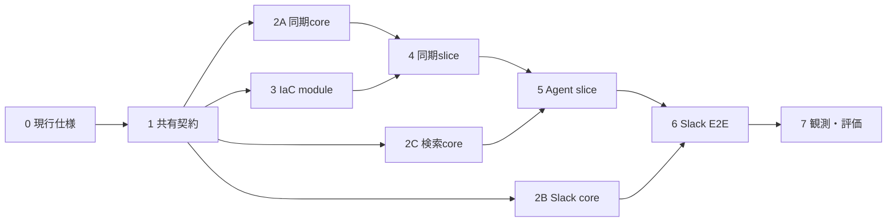

# 実装計画

この文書はMVP実装の開始条件、予定ファイル、task graph、指示役エージェントの進め方、完了条件の正本である。設計値は[architecture.md](architecture.md)、Azure設定は[platform-and-operations.md](platform-and-operations.md)を参照する。

## 開始条件

- [プラットフォームと運用の費用方針](platform-and-operations.md#コストと日常運用)に従った実resource作成の許可を得ること
- 実装開始時にHosted Agentの公式sampleを確認し、`azd`、Foundry extension、Agent Framework、Functions runtime、AVMについて、事前に決められるversion / 最低constraint、dependency syncで固定するversionの境界、生成物を確定すること
- `azd provision`直前にFoundryのregion、SKU、model version、TPMのcapacity / quotaと料金を再確認すること
- Slack App、Key VaultのbootstrapとGitHub同期元の設定に必要な実値を安全に用意できること

変化しやすいCLI option、package version、role名はこの文書へ固定しない。実装開始時の調査結果を各manifest、lockfile、`azure.yaml`、Bicep commentへ反映する。

現行仕様の確認結果は[実装開始時の現行仕様確認](research/implementation-current-spec-2026-08-11.md)に記録した。Step 1ではこの記録から`azure.yaml`、`pyproject.toml`、lockfileへ値を転記し、生成済みsampleをrepositoryへ直接展開しない。

## 予定ファイル

Function AppとHosted Agentは依存とdeploy単位が異なるため、別のuv projectとして分ける。下表は指示役がownershipを割り当てるための予定境界であり、scaffoldの現行仕様により変更するときは、コード作成前にこの表を更新する。

| path | 内容 |
|---|---|
| `azure.yaml` | `azd` project、Foundry project / model deployment、Hosted Agent service、Bicep連携の正本 |
| `infra/main.bicep`、`infra/app/*.bicep` | resource group、Functions / Storage、Cosmos、Foundry、observability、Key Vault / identity |
| `slack/manifest.yaml` | secretと実Request URLを含まないSlack App manifest template |
| `src/functions/function_app.py`、`src/functions/host.json` | Sync、Slack Events、Agent Workerのtrigger登録とFunction App共通設定 |
| `src/functions/knowledge_agent/contracts.py` | Queue、Table、Cosmos、設定名の共有契約 |
| `src/functions/knowledge_agent/sync.py`、`github_source.py`、`chunking.py` | GitHub同期と外部接続を持たない変換処理 |
| `src/functions/knowledge_agent/settings.py`、`http_transport.py`、`azure_adapters.py`、`sync_function.py`、`sync_runtime.py` | 同期設定、認証付きGitHub HTTP、Azure SDK adapter、Timer handlerと遅延runtime結線 |
| `src/functions/knowledge_agent/state.py`、`slack_events.py`、`worker.py`、`slack_runtime.py`、`telemetry.py` | 状態、Slack受信・応答、Agent呼び出し、Slack/Worker用の遅延runtime結線、観測 |
| `src/functions/pyproject.toml`、`src/functions/uv.lock` | Function Appの依存とtool設定 |
| `src/functions/tests/` | Azureへ接続しないFunction Appのunit test |
| `src/agent/main.py`、`src/agent/knowledge_search.py` | Responses protocolのHosted AgentとCosmos検索tool |
| `src/agent/pyproject.toml`、`src/agent/uv.lock`、`src/agent/.azdignore` | Hosted Agentの依存、build対象、除外設定 |
| `src/agent/tests/` | query/result整形など外部接続を要しないunit test |
| `eval/smoke.jsonl` | queryと期待source記事を持つ固定smoke dataset |
| `scripts/assign-agent-roles.ps1`、`scripts/run-smoke-evaluation.py` | post-deploy RBACとsmoke evaluation |
| `.github/workflows/ci.yml` | ruff、pytest、package layout、repository policyなどAzureへログインしないCI。Bicep buildはStep 3で追加 |
| 既存の`.github/workflows/repository-policy.yml`、`scripts/check-repository-policy.ps1` | 指示ファイル同期とrepository policy検証 |

生成した`requirements.txt`、`.azure/`、ローカル設定、deployment outputはcommitしない。testはfront matter検証、chunk分割、blob SHA差分判定、Slack署名・event選別、thread key、payload変換を中心とし、Azure SDKの詳細なmockは作らない。

## 指示役エージェントの進め方

指示役はtask graph、共有契約、統合、検証のownerになる。各stepの開始時に現状のdiffと前stepのgateを確認し、完了していない依存先を飛ばさない。

サブエージェントへ渡すtaskには、最低限次を含める。

- 目的と完了条件
- 参照する設計正本と確定済みの契約
- 編集してよいpathと、触れてはいけない共有file
- 依存するtask、実行する検証、返す要約

`azure.yaml`、`infra/main.bicep`、trigger登録、lockfile、横断的なschemaは、同時に複数agentへ編集させない。指示役または一人の明示的なownerだけが更新する。サブエージェントの結果は自己申告だけで完了扱いにせず、指示役がdiff、test、設計との整合を確認して統合する。

### 並列化の判断

次の条件をすべて満たすtaskだけを並列化する。

- 入出力と完了条件が独立している
- 同じfile、lockfile、外部resourceを変更しない
- 一方の判断や生成物を他方が待つ必要がない
- 結果を個別に検証してから統合できる

read-onlyの現行仕様調査、確定済み契約に対する別moduleとそのtestは並列化候補である。共有設定の決定、依存更新、Azure / Slackへの書き込み、provision / deploy、RBAC、end-to-end確認、失敗原因がまだ絞れていない修正は直列で行う。並列化による待ち時間短縮が小さい場合は一agentで進める。

## Task graph

矢印は依存関係、同じ段から分岐するtaskは条件を満たす場合の並列化候補を表す。番号順にすべてを直列実行する必要はない。

### 0. 現行仕様の再確認

Hosted Agent / `azd`、Azure IaC / RBAC / capacity、Functions / Slackの3観点を確認し、事前に決められるversion / 最低constraintとlock方針、scaffold、role、preview差分を確定する。調査はread-onlyなので必要なら並列化できるが、指示役が結果を設計正本へ統合してから次へ進む。

**状態:** 2026-08-11完了。runtime / protocol、toolの最低version constraint、source-code deploymentの生成形、RBAC名称とscope、Functions / Slack差分、AVM versionを[調査記録](research/implementation-current-spec-2026-08-11.md)と設計正本へ反映した。Python packageの正確な採用versionは依存解決前には断定せず、Step 1のlockfileで固定する。実resource、外部サービス、依存関係は変更していない。

**gate:** 予定ファイルと設計文書に未解決の矛盾がなく、runtime / protocol、toolの最低version constraint、Python packageのlock方針、AVM versionを各manifestとBicepへ転記できる。依存解決後の正確なPython package versionはStep 1のlockfile gateで確認する。

### 1. 共有契約とproject skeleton

最初にQueue message、Table entity、Cosmos chunk、設定名の契約をtest fixtureで固定する。その後、指示役が`azure.yaml`、共通設定、CI entry pointを作り、FunctionsとHosted Agentのproject skeletonはpathを分けて作成する。

**進捗:** 共有契約とfixtureに加え、`azure.yaml`、Functions v2とHosted Agentのproject skeleton、Python 3.13の`pyproject.toml` / `uv.lock`、CI entry pointを作成した。`sfw`経由の依存同期、ruff、unit test、compile、remote build用`requirements.txt`の生成とpackage root配置は確認済み。Foundry extension、Functions Core Tools、Bicep CLIは未導入のため、それらを使うscaffold / host / Bicep検証は未完了である。

共有契約の確定後であれば、`src/functions/`と`src/agent/`のskeleton作成は並列化できる。trigger登録とlockfileには各一人だけを割り当てる。

**gate:** `sfw`経由のdependency sync、ruff、import / contract unit test、package root検査、repository policy検証をローカルで再現できる。Azure接続は不要とする。Foundry extension / Functions Core Toolsによる検証はtool導入後に追加確認し、IaC未実装のStep 1へ空のBicepを置かないためBicep buildはStep 3 gateだけで扱う。

### 2. 外部接続を持たないcore実装

次を独立laneとして実装する。

1. GitHub tree差分、front matter、chunk化、削除差分
2. Slack署名、event選別、重複判定入力、thread key、Queue payload
3. `knowledge_search`のquery / Cosmos result / citation整形

**状態:** 2026-08-11完了。GitHub API request / response境界、tree・blob・chunking versionの決定的reconcile、strict front matter、Markdown正規化とheading-aware chunk、既存記事不正時のatomic停止、新規記事errorの部分継続、embedding / index portを2Aとして実装した。Slack HMAC、event選別、重複判定用entityとQueue payload、source保持切詰めを2B、query embedding / vector検索port、untrusted JSON境界、distance安定昇順、citation整形とGitHub URL allowlistを2Cとして実装した。すべて外部接続を注入境界の外へ置き、実Azure / GitHub / Slackは変更していない。

契約が固定済みで編集pathが重ならない場合だけlaneを並列化する。各laneは実装とunit testを同じownerが担当する。

**gate:** Azureへ接続しないunit testが通り、境界値と失敗時の扱いが[architecture.md](architecture.md)に一致する。

### 3. IaCとdeploy wiring

`infra/app/*.bicep`を実装し、`infra/main.bicep`と`azure.yaml`へ統合する。moduleのinput / outputを先に決めれば各Bicep moduleは並列化できるが、`main.bicep`、parameter、`azure.yaml`のownerは一人に限定する。post-deployでだけ可能なAgent identityのCosmos role assignmentもscript化する。

**進捗:** 2026-08-12にCIへ`az bicep build`を追加し、gateを閉じた。subscription / resource groupと、Functions / Storage、Cosmos、Foundry / model、observability、Key Vault / identityのmodule、post-deployのAgent Cosmos reader assignmentを実装した。model deploymentは`azure.yaml`から`AI_PROJECT_DEPLOYMENTS`で渡し、extensionとBicepの二重定義を避けた。direct source ZIP deploymentに顧客ACRは不要なため構成に含めない。固定AVM tagは公式Git refsで実在を再確認し、telemetry無効化、RBAC、diagnostic settings、secure outputはlocal policy検査で固定済みである。2026-08-12に固定AVM moduleを`mcr.microsoft.com`のpinned tagからlocal cacheへrestoreし、`az bicep build infra/main.bicep`がローカルで成功することを確認した。残る警告はCosmos preview API版のBCP081のみで、errorはない。実resourceは作成していない。

**gate:** 静的検査、ローカルとCIのBicep buildは完了。secretや実resource値を出力・commitせず、ここではまだprovisionしない。

### 4. 同期vertical slice

先に実resourceへ接続しないAzure adapterとmock integration testを実装する。実resource作成の許可、capacity、料金を再確認してから`azd provision`し、一記事の取得、chunk、embedding、Cosmos upsert、Table state更新を通す。その後、同じSHAで再embeddingしないことと、更新・削除のreconcileを確認する。

**進捗:** 2026-08-11に実resourceへ接続しないcode-side sliceを完了した。毎日18:00 UTC（JST 03:00）のTimer、GitHub HTTP、Foundry embedding、Cosmos記事置換、Table sync stateをManaged IdentityのSDK clientへ結線した。clientはDI可能で、GitHubとAzure SDKのtimeout / retryを固定し、secretやendpointをerrorへ含めない。Cosmosは記事の全chunk manifestを検査し、小記事のupsert / stale deleteを単一transactional batchへまとめる。大記事だけを100 operations / 保守的1.8 MiBで分割し、途中状態を`needs_reindex`として次回に記事全体reindexする。`success|partial|failed`のstate遷移、無変更・差分・新規/既存不正・batch境界・途中manifestをmock integration testで確認済みである。Azure SDKの正確なversionはFunctionsの`uv.lock`へ固定した。実Azure / GitHub通信、resource作成、capacity / 料金確認は行っていない。

外部resourceと永続状態を共有するため、このstepは直列で行う。

2026-08-12に、同期対象repositoryが非公開である実態に合わせて取得経路を認証付きへ戻した。commit SHAとtreeはKey Vault由来のGitHub tokenで認証したGitHub APIから取得し、記事本文は`raw.githubusercontent.com`ではなくGit Blobs APIの`application/vnd.github.raw`から、treeが返したblob SHAで取得する。tokenは設定の`repr`にもerrorにも出ず、許可hostは`api.github.com`だけに絞った。

**gate:** code-sideのunit / mock integration gateは完了。実resource作成の許可、capacity / 料金再確認、Key VaultへのGitHub token投入、provision後に、初回、無変更二回目、更新、削除の4ケースを実環境で追跡するlive gateが残る。

### 5. Hosted Agent vertical slice

`ResponsesHostServer`と`knowledge_search`を接続し、Bicep output由来の`COSMOS_ENDPOINT`と専用`EMBEDDING_MODEL_DEPLOYMENT_NAME`がazd環境からAgentへ注入されることを確認してsource-code deploymentでAgent versionを作る。database `knowledge`とcontainer `chunks`は共有契約の固定値を使う。同一projectのmodel inferenceはAgent identityへimplicitに付与されるため追加roleを作らず、deploy後にbeta.9以降のextensionが出力するAgent principal IDへCosmos Readerだけを付与する。root `postdeploy` hookはrole assignmentを先に完了し、次にFoundry extensionが生成したResponses endpointをFunction Appの`KNOWLEDGE_AGENT_ENDPOINT`へ冪等反映する。空・不正値ではfail closedとなり、値をlogへ出さないことも確認してから、Slackを介さず直接invokeして根拠記事付き回答を確認する。

同期済みdata、Agent version、identityが順に必要なため、このstepは直列で行う。

**進捗:** 2026-08-11に`FoundryChatClient` / `ResponsesHostServer`へ`knowledge_search` toolを結線し、query専用embedding設定、Cosmos vector query、untrusted data境界、citation / 根拠不足時の回答規則、Responses側の会話所有、SDK timeout / retry / lifecycleをmock testで固定した。tool instanceに累積上限を持たせず、lock済みFoundry 1.10.4 / Core 1.13.0の実classでrequest単位`max_function_calls = 3`が保持されることと、5回の独立呼出し後もtoolが利用可能なことを確認した。chat OpenAIを含む全SDK clientをexact-onceで閉じ、構築途中の失敗でも既生成clientを閉じる。beta.9のAgent principal ID outputを使うCosmos Reader assignmentとFunction endpoint設定をroot postdeployへfail-closedな順序で接続し、Azure CLIの両streamと外側hook出力から実値を除去した。実通信・deployは行っていない。2026-08-12に`sfw uv lock`でAgentのdirect依存`azure-cosmos`を`uv.lock`へ固定し、`uv sync --locked`、ruff、unit test、`uv export --frozen`、package layout検査がローカルで通ることを確認した。

**gate:** code-sideのlock / lint / test / export gateは完了。実環境ではAgent Managed Identityによるquery embeddingとCosmos vector queryが成功し、credentialをcodeやlogへ出さないことを確認する作業が残る。

### 6. Slack end-to-end slice

Slack Events Function、Queue、Agent Worker、conversation state、`eyes` reaction、thread返信を接続する。Request URLのbootstrap後、トップレベルDM一件と追い質問一件を通し、allowlist外、再送event、poison messageも確認する。

**進捗:** 2026-08-12に実resourceへ接続しないcode-side sliceを完了した。認証なしで公開するHTTP trigger、`slack-questions` Queue trigger、Table event claim、conversation state、Slack Web API、Hosted Agent呼び出しを結線した。event重複はInsert Entityの成否だけを排他とし、allowlist外とDM以外は`unauthorized_source` / `unsupported_conversation_type`の監査記録を残して2xxを返す。Hosted Agentは`KNOWLEDGE_AGENT_ENDPOINT`を`AzureOpenAI`の`base_url`へ渡し、Managed Identity tokenを`azure_ad_token_provider`で更新する。`previous_response_id`は7日以内の参照だけを使い、Agent応答→conversation state保存→thread返信の順にして再試行で二重投稿しないようにした。Slack App manifest templateとQueueのbase64 encodingも固定した。Signing SecretとBot tokenは設定の`repr`にもerrorにも出ない。実Slack / Azure通信とdeployは行っていない。

`eyes`は質問メッセージ自身へ付ける必要があるため、Queue message契約へ`messageTs`を追加し[architecture.md](architecture.md#状態とメッセージ契約)とfixtureを更新した。

実装済みmoduleの結線と一つのSlack Appを扱うため、deployと疎通確認は直列で行う。

**gate:** code-sideのunit gateは完了。Slack App作成、Request URL登録、Key Vaultへのsecret投入の後に、Slack DM → Queue → Agent → Cosmos → Slack threadが成功し、`previous_response_id`で追い質問が継続することを実環境で確認するliveゲートが残る。

### 7. 観測、評価、配送の仕上げ

W3C Trace Context、固定span、content保護、smoke datasetと実行script、CIを仕上げる。telemetryとevaluationの実装は編集pathを分けられる場合に並列化できるが、最終trace確認と全validationは指示役が直列で行う。

**進捗:** 2026-08-12に、[quality.md](quality.md#telemetry)のspan表どおりの固定span名、属性のallowlist、Slack HTTPからQueueを越えるW3C Trace Context伝播、Agent側の`knowledge.search` / `cosmos.vector_query`を実装した。Slack一問が一traceに収まることをin-memory exporterのtestで確認している。属性は識別子・件数・結果値だけを許可し、質問文、回答、Signing Secret、Bot token、Authorization headerはcustom spanへ記録できない。Python workerがOTelを直接streamするよう`PYTHON_APPLICATIONINSIGHTS_ENABLE_TELEMETRY`をBicepへ追加し、CIへBicep buildを加えてStep 3の残作業も閉じた。smoke evaluationのschema、citation照合、実行scriptに加え、実記事28件から作った10件の`eval/smoke.jsonl`も用意した。caseはOAuth、サプライチェーン、Azureコスト、LangGraph、trace、Foundryなど主題が重ならないよう選び、1件は`published: false`の記事にして、公開状態で検索対象を絞らない設計が実際に効くことを確認できるようにした。

**gate:** telemetryとevaluation scriptのcode-side gateは完了。一件のSlack質問と一件のGitHub同期をtraceで追え、10件のsmoke evaluationを実環境で実行できることを確認するliveゲートが残る。

## 実装時に決める項目

- Application Insightsの保持期間とsampling
- smoke evaluationのbaseline後の改善優先度
- GitHub tokenの有効期限と、失効時にKey Vaultのsecretを差し替える頻度
- Foundryが`responseId`を保持する期間の実測値と、会話継続の上限7日をそれに収める調整

## MVP完了条件

- `articles/**/*.md`を初期同期でき、default branchの変更と削除が次回Timerで反映される。
- 変更のない記事が再embeddingされないことを、二回目のTimer実行で確認できる。
- 許可した利用者からのSlack DMに、根拠記事へのリンク付きでthread返信できる。
- 同じSlack threadの直前の質問を踏まえた追い質問に答えられ、トップレベルDMまたは7日経過後は新しい会話として扱われる。
- Slack `event_id`の重複チェックにより、event再送で同じQueue messageを二重投入しない。
- allowlist外のworkspace・利用者とDM以外の会話には回答せず、監査記録だけが残る。
- AgentがManaged IdentityでCosmosを検索し、credentialをコードやログへ出さない。
- 一件のSlack質問と一件のGitHub同期をtraceで追跡できる。
- 固定約10件のsmoke evaluationを実行し、結果とtraceを確認できる。
- `azd provision` / `azd deploy` と、失敗を修正して再deployする手順を再現できる。

production trace評価、continuous evaluation、rollback機構、コールドスタート対策のalways-ready instanceはMVP完了条件に含めない。
