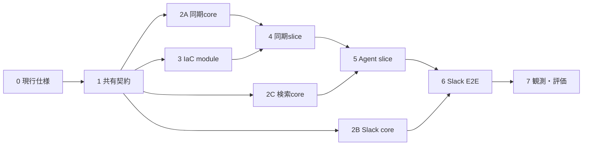

# 実装計画

この文書はMVP実装の開始条件、予定ファイル、task graph、指示役エージェントの進め方、完了条件の正本である。設計値は[architecture.md](architecture.md)、Azure設定は[platform-and-operations.md](platform-and-operations.md)を参照する。

## 開始条件

- [プラットフォームと運用の費用方針](platform-and-operations.md#コストと日常運用)に従った実resource作成の許可を得ること
- 実装開始時にHosted Agentの公式sampleを確認し、`azd`、Foundry extension、Agent Framework、Functions runtime、AVMの採用versionと生成物を確定すること
- `azd provision`直前にFoundryのregion、SKU、model version、TPMのcapacity / quotaと料金を再確認すること
- Slack App、Key VaultのbootstrapとGitHub同期元の設定に必要な実値を安全に用意できること

変化しやすいCLI option、package version、role名はこの文書へ固定しない。実装開始時の調査結果を各manifest、lockfile、`azure.yaml`、Bicep commentへ反映する。

## 予定ファイル

Function AppとHosted Agentは依存とdeploy単位が異なるため、別のuv projectとして分ける。下表は指示役がownershipを割り当てるための予定境界であり、scaffoldの現行仕様により変更するときは、コード作成前にこの表を更新する。

| path | 内容 |
|---|---|
| `azure.yaml` | `azd` project、Foundry project / model deployment、Hosted Agent service、Bicep連携の正本 |
| `infra/main.bicep`、`infra/app/*.bicep` | resource group、Functions / Storage、Cosmos、Foundry、observability、Key Vault / identity |
| `slack/manifest.yaml` | secretと実Request URLを含まないSlack App manifest template |
| `src/functions/function_app.py`、`src/functions/host.json` | Sync、Slack Events、Agent Workerのtrigger登録とFunction App共通設定 |
| `src/functions/knowledge_agent/contracts.py` | Queue、Table、Cosmos、設定名の共有契約 |
| `src/functions/knowledge_agent/sync.py`、`github_source.py`、`chunking.py` | GitHub同期と外部接続を持たない変換処理 |
| `src/functions/knowledge_agent/state.py`、`slack_events.py`、`worker.py`、`telemetry.py` | 状態、Slack受信・応答、Agent呼び出し、観測 |
| `src/functions/pyproject.toml`、`src/functions/uv.lock` | Function Appの依存とtool設定 |
| `src/functions/tests/` | Azureへ接続しないFunction Appのunit test |
| `src/agent/main.py`、`src/agent/knowledge_search.py` | Responses protocolのHosted AgentとCosmos検索tool |
| `src/agent/pyproject.toml`、`src/agent/uv.lock`、`src/agent/.agentignore` | Hosted Agentの依存、build対象、除外設定 |
| `src/agent/tests/` | query/result整形など外部接続を要しないunit test |
| `eval/smoke.jsonl` | queryと期待source記事を持つ固定smoke dataset |
| `scripts/assign-agent-roles.ps1`、`scripts/run-smoke-evaluation.py` | post-deploy RBACとsmoke evaluation |
| `.github/workflows/ci.yml` | ruff、pytest、Bicep buildなどAzureへログインしないCI |
| 既存の`.github/workflows/repository-policy.yml`、`scripts/check-repository-policy.ps1` | 指示ファイル同期とrepository policy検証 |

生成した`requirements.txt`、`.azure/`、ローカル設定、deployment outputはcommitしない。testはfront matter検証、chunk分割、blob SHA差分判定、Slack署名・event選別、thread key、payload変換を中心とし、Azure SDKの詳細なmockは作らない。

## 指示役エージェントの進め方

指示役はtask graph、共有契約、統合、検証のownerになる。各stepの開始時に現状のdiffと前stepのgateを確認し、完了していない依存先を飛ばさない。

サブエージェントへ渡すtaskには、最低限次を含める。

- 目的と完了条件
- 参照する設計正本と確定済みの契約
- 編集してよいpathと、触れてはいけない共有file
- 依存するtask、実行する検証、返す要約

`azure.yaml`、`infra/main.bicep`、trigger登録、lockfile、横断的なschemaは、同時に複数agentへ編集させない。指示役または一人の明示的なownerだけが更新する。サブエージェントの結果は自己申告だけで完了扱いにせず、指示役がdiff、test、設計との整合を確認して統合する。

### 並列化の判断

次の条件をすべて満たすtaskだけを並列化する。

- 入出力と完了条件が独立している
- 同じfile、lockfile、外部resourceを変更しない
- 一方の判断や生成物を他方が待つ必要がない
- 結果を個別に検証してから統合できる

read-onlyの現行仕様調査、確定済み契約に対する別moduleとそのtestは並列化候補である。共有設定の決定、依存更新、Azure / Slackへの書き込み、provision / deploy、RBAC、end-to-end確認、失敗原因がまだ絞れていない修正は直列で行う。並列化による待ち時間短縮が小さい場合は一agentで進める。

## Task graph

矢印は依存関係、同じ段から分岐するtaskは条件を満たす場合の並列化候補を表す。番号順にすべてを直列実行する必要はない。

### 0. 現行仕様の再確認

Hosted Agent / `azd`、Azure IaC / RBAC / capacity、Functions / Slackの3観点を確認し、採用version、scaffold、role、preview差分を確定する。調査はread-onlyなので必要なら並列化できるが、指示役が結果を設計正本へ統合してから次へ進む。

**gate:** 予定ファイルと設計文書に未解決の矛盾がなく、実resourceを作らずに固定できるversionがmanifestへ記録できる。

### 1. 共有契約とproject skeleton

最初にQueue message、Table entity、Cosmos chunk、設定名の契約をtest fixtureで固定する。その後、指示役が`azure.yaml`、共通設定、CI entry pointを作り、FunctionsとHosted Agentのproject skeletonはpathを分けて作成する。

共有契約の確定後であれば、`src/functions/`と`src/agent/`のskeleton作成は並列化できる。trigger登録とlockfileには各一人だけを割り当てる。

**gate:** `sfw`経由のdependency sync、ruff、import / contract unit test、Bicep build、repository policy検証をローカルで再現できる。Azure接続は不要とする。

### 2. 外部接続を持たないcore実装

次を独立laneとして実装する。

1. GitHub tree差分、front matter、chunk化、削除差分
2. Slack署名、event選別、重複判定入力、thread key、Queue payload
3. `knowledge_search`のquery / Cosmos result / citation整形

契約が固定済みで編集pathが重ならない場合だけlaneを並列化する。各laneは実装とunit testを同じownerが担当する。

**gate:** Azureへ接続しないunit testが通り、境界値と失敗時の扱いが[architecture.md](architecture.md)に一致する。

### 3. IaCとdeploy wiring

`infra/app/*.bicep`を実装し、`infra/main.bicep`と`azure.yaml`へ統合する。moduleのinput / outputを先に決めれば各Bicep moduleは並列化できるが、`main.bicep`、parameter、`azure.yaml`のownerは一人に限定する。post-deployでだけ可能なAgent identityのCosmos role assignmentもscript化する。

**gate:** Bicep buildと静的検査が通り、secretや実resource値を出力・commitしない。ここではまだprovisionしない。

### 4. 同期vertical slice

実resource作成の許可、capacity、料金を再確認してから`azd provision`する。Sync FunctionのAzure adapterを接続し、一記事の取得、chunk、embedding、Cosmos upsert、Table state更新を通す。その後、同じSHAで再embeddingしないことと、更新・削除のreconcileを確認する。

外部resourceと永続状態を共有するため、このstepは直列で行う。

**gate:** 初回、無変更二回目、更新、削除の4ケースを実環境で追跡できる。

### 5. Hosted Agent vertical slice

`ResponsesHostServer`と`knowledge_search`を接続し、source-code deploymentでAgent versionを作る。deploy後にAgent identityへ必要なCosmos / embedding権限を付与し、Slackを介さず直接invokeして根拠記事付き回答を確認する。

同期済みdata、Agent version、identityが順に必要なため、このstepは直列で行う。

**gate:** Agent Managed Identityによるquery embeddingとCosmos vector queryが成功し、credentialをcodeやlogへ出さない。

### 6. Slack end-to-end slice

Slack Events Function、Queue、Agent Worker、conversation state、`eyes` reaction、thread返信を接続する。Request URLのbootstrap後、トップレベルDM一件と追い質問一件を通し、allowlist外、再送event、poison messageも確認する。

実装済みmoduleの結線と一つのSlack Appを扱うため、deployと疎通確認は直列で行う。

**gate:** Slack DM → Queue → Agent → Cosmos → Slack threadが成功し、`previous_response_id`で追い質問が継続する。

### 7. 観測、評価、配送の仕上げ

W3C Trace Context、固定span、content保護、smoke datasetと実行script、CIを仕上げる。telemetryとevaluationの実装は編集pathを分けられる場合に並列化できるが、最終trace確認と全validationは指示役が直列で行う。

**gate:** 一件のSlack質問と一件のGitHub同期をtraceで追え、約10件のsmoke evaluationと全ローカルvalidationを再実行できる。

## 実装時に決める項目

- chunk size / overlapと、batch制限を超える記事を記事単位で再実行する方法
- Application Insightsの保持期間とsampling
- 実記事から作るsmoke dataset、baseline後の改善優先度
- 固定するAVM versionと、必要propertyが未対応の場合のraw Bicep
- Function App MIとHosted Agent identityに付与するFoundryのdata-plane role名
- Foundryが`responseId`を保持する期間の実測値と、会話継続の上限7日をそれに収める調整

## MVP完了条件

- `articles/**/*.md`を初期同期でき、default branchの変更と削除が次回Timerで反映される。
- 変更のない記事が再embeddingされないことを、二回目のTimer実行で確認できる。
- 許可した利用者からのSlack DMに、根拠記事へのリンク付きでthread返信できる。
- 同じSlack threadの直前の質問を踏まえた追い質問に答えられ、トップレベルDMまたは7日経過後は新しい会話として扱われる。
- Slack `event_id`の重複チェックにより、event再送で同じQueue messageを二重投入しない。
- allowlist外のworkspace・利用者とDM以外の会話には回答せず、監査記録だけが残る。
- AgentがManaged IdentityでCosmosを検索し、credentialをコードやログへ出さない。
- 一件のSlack質問と一件のGitHub同期をtraceで追跡できる。
- 固定約10件のsmoke evaluationを実行し、結果とtraceを確認できる。
- `azd provision` / `azd deploy` と、失敗を修正して再deployする手順を再現できる。

production trace評価、continuous evaluation、rollback機構、コールドスタート対策のalways-ready instanceはMVP完了条件に含めない。
